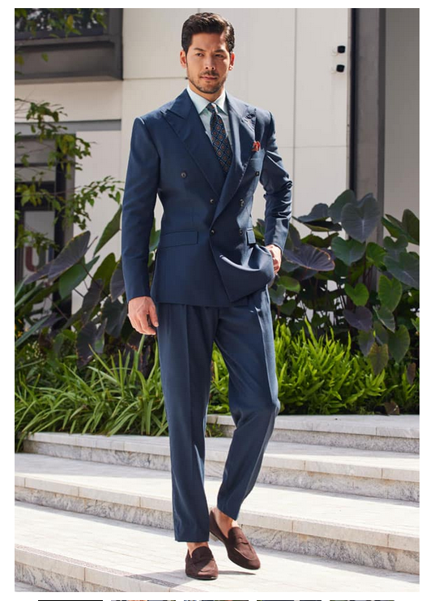
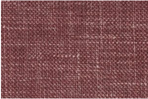
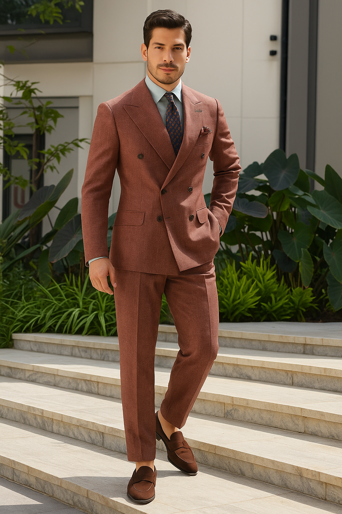
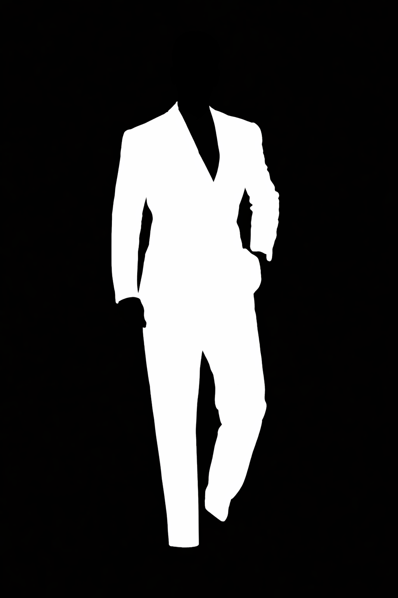
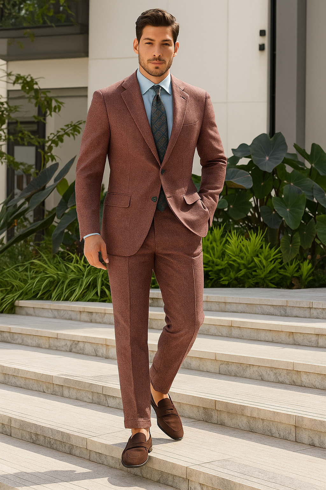

## Project Overview
This project explores whether OpenAI’s image editing capabilities can automate a traditionally manual step in bespoke tailoring workflows: visualizing how a fabric will look when applied to a tailored suit.

The goal was to assess whether generative image editing could reliably replace or reduce manual image preparation when new fabrics are introduced—without degrading realism or altering non-target elements of the image.

---

## Business Problem
The client is a **fabric distributor serving bespoke tailors**.
They operate an online tool that allows tailors and customers to preview fabrics on a suit model before ordering.

### Current workflow
- Each new fabric design must be manually applied to a suit image
- The process is:
  - time-consuming
  - design-dependent
  - difficult to scale as the catalog grows
- This creates friction between fabric launches and digital availability

### Objective
Reduce manual effort by using AI to:
- Automatically apply a fabric design onto a suit jacket
- Preserve garment realism (folds, lapels, buttons)
- Avoid modifying unrelated elements (model’s face, tie, background)

---

## Proposed Approach
Leverage OpenAI’s **image editing** capability to programmatically apply fabric textures onto a fashion model image.

High-level idea:
- Provide a base image of a fashion model in a suit
- Provide a fabric design image
- Prompt the model to apply the fabric only to the jacket while preserving all other visual features

---

## Implementation Steps

### 1. Studied OpenAI Image Editing API
- Reviewed API documentation for image editing and inpainting
- Identified support for:
  - base image input
  - referenced images
  - optional image masks
  - text-based editing instructions

---

### 2. Baseline Experiment (No Mask)
**Inputs**

| Fashion model | Fabric design |
|--------------|---------------|
|  |  |

Left: Base fashion model (model_sample.png)
Right: Fabric design sample (fabric_sample.png)


**Prompt (simplified)**
> Apply the fabric pattern from the fabric_image to the Jacket in fashion_model. Match scale, direction, and weave realism. Maintain original shadows, highlights, and garment structure. Do not recolor other parts


**javascript put together**
```
import fs from "fs";
import OpenAI, { toFile } from "openai";

const client = new OpenAI({ apiKey: process.env.OPENAI_API_KEY }) // Note: do not save key in the script

const modelimage = await toFile(fs.createReadStream("model_sample.png"), "fashion_model", {
  type: "image/png",
})

const fabricimage = await toFile(fs.createReadStream("fabric_sample.png"), "fabric_image", {
  type: "image/png",
})


const rsp = await client.images.edit({
    model: "gpt-image-1",
    image: [modelimage, fabricimage],
    prompt: "Apply the fabric pattern from the fabric_image to the Jacket in fashion_model. Match scale, direction, and weave realism. Maintain original shadows, highlights, and garment structure. Do not recolor other parts"
});

// Save the image to a file
const image_base64 = rsp.data[0].b64_json;
const image_bytes = Buffer.from(image_base64, "base64");
fs.writeFileSync("test_out.png", image_bytes);
```

---

### 3. Baseline Result (Without Mask)

**Observations**



- The jacket fabric application was visually convincing
- Key tailoring details were largely preserved:
  - lapels
  - folds
  - general jacket structure

**Issues**
- The model also modified:
  - the tie
  - the fashion model’s face (!)
- These changes were subtle but unacceptable for a commercial preview tool

**Conclusion**
Prompt-only control is insufficient for isolating edits to a specific garment region.

---

## Mask-Based Experiment

### 4. Hypothesis

According to the , the optional mask will define the area for editing.  

Thus, providing an **image mask** that explicitly defines the editable region (the jacket) should constrain the model’s edits and prevent unintended changes.

---

### 5. Masked Setup



- Created a binary mask:
  - white = jacket region (editable)
  - black = everything else (locked)
- Reused the same:
  - base image
  - fabric design
  - prompt

**javascript put together**
  ```
  import fs from "fs";
  import OpenAI, { toFile } from "openai";

  const client = new OpenAI({ apiKey: process.env.OPENAI_API_KEY }) // Note: do not save key in the script

  const modelimage = await toFile(fs.createReadStream("model_sample.png"), "fashion_model", {
    type: "image/png",
  })

  const fabricimage = await toFile(fs.createReadStream("fabric_sample.png"), "fabric_image", {
    type: "image/png",
  })

  const maskimage = await toFile(fs.createReadStream("jacket_mask.png"), "mask", {
    type: "image/png",
  })

  const rsp = await client.images.edit({
      model: "gpt-image-1",
      image: [modelimage, fabricimage],
      mask: maskimage,
      prompt: "Apply the fabric pattern from the fabric_image to the Jacket in fashion_model. Match scale, direction, and weave realism. Maintain original shadows, highlights, and garment structure. Do not recolor other parts"
  });

  // Save the image to a file
  const image_base64 = rsp.data[0].b64_json;
  const image_bytes = Buffer.from(image_base64, "base64");
  fs.writeFileSync("test_out.png", image_bytes);
  ```

---

### 6. Masked Result



**What improved**
- Fabric placement remained convincing
- Jacket texture alignment stayed realistic

**What did *not* improve**
- The model still altered:
  - the fashion model’s face
  - the tie
- Additional regression:
  - jacket buttons were modified despite being part of the masked region

**Key Insight**
Even with an explicit mask, the model does not strictly treat masked-out regions as immutable.

---

## Findings & Limitations

### What works
- GPT-image can convincingly:
  - apply fabric textures
  - preserve lighting and garment folds
- Suitable for:
  - rapid concept previews
  - internal design iteration
  - non-final visualization

### What does not (yet)
- Strict region isolation is not guaranteed
- Fine-grained garment details (buttons, accessories) are unstable
- Masking improves focus but does not fully constrain edits

---

## Business Implications
- **Partial automation is feasible**: AI can reduce manual work, but not eliminate it
- **Human-in-the-loop remains necessary** for:
  - final catalog images
  - client-facing previews
- The approach is promising for:
  - internal tools
  - early-stage fabric exploration
  - reducing design iteration time

---

## Next Steps
Potential improvements to explore:
- Give more specific prompts including instructions to not alter the fashion model.
- Try providing only the Jacket silhouette to input (will require a multi-step pipeline to then fit it on a base fashion model).
- Try other open source models including 

Tech considerations:
- Integrate the simple POC script to a database of the client's fabric catalog.
- User-friendly UI for layman employee to operate the tool

---

## Takeaway
This project demonstrates both the **promise and current limitations** of generative image editing in a real commercial workflow. While OpenAI’s image models can produce highly convincing fabric applications, achieving production-grade control over *what may and may not change* remains an open challenge.

For bespoke tailoring, the technology is not a silver bullet—but it is a meaningful step toward scalable visualization.
